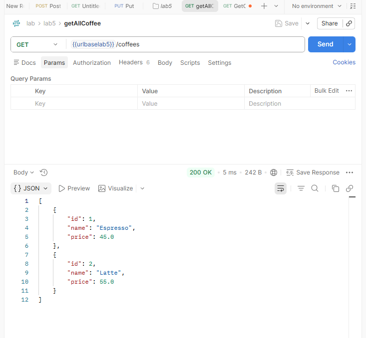
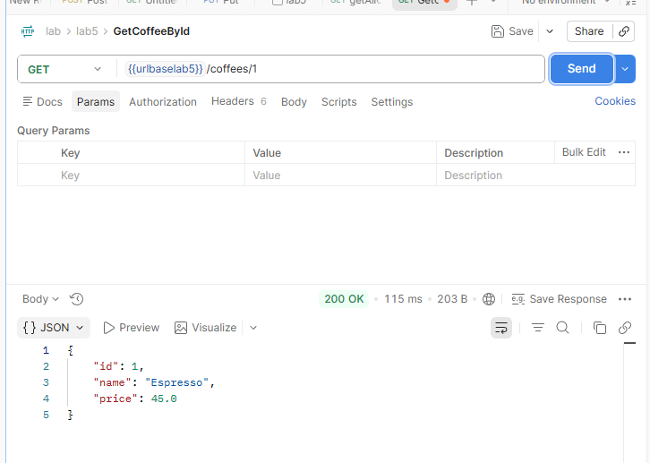
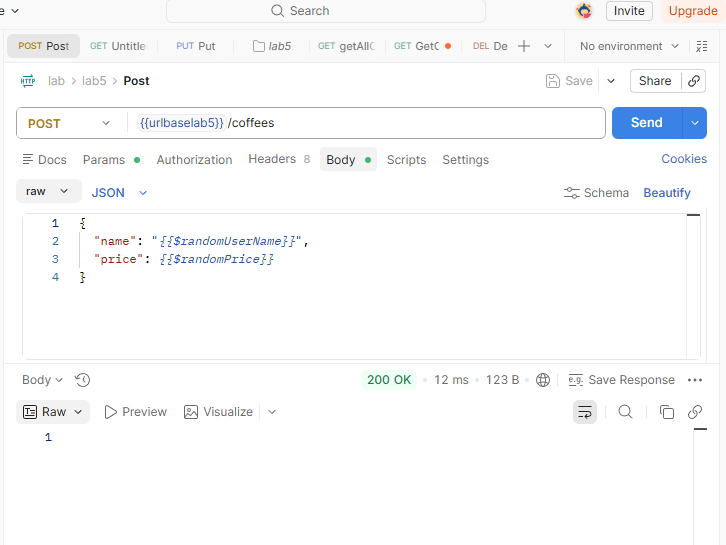
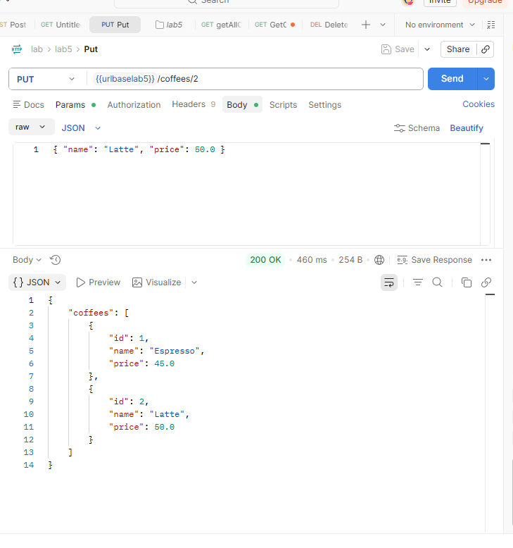

## 673380280-2 ปิยะพล ตุ่นป่า 
------------------------------
# ☕ Lab 5.1: Spring Boot REST API (Coffee Service)

เอกสารนี้อธิบายการทำงานของ RESTful API สำหรับระบบจัดการข้อมูลกาแฟ (Coffee Service) ที่พัฒนาด้วย **Spring Boot** โดยมีการแบ่งโครงสร้างโค้ดออกเป็นชั้น **Controller** (`CoffeController.java`) และ **Service** (`CoffeeService.java`) พร้อมอธิบายผลลัพธ์การทดสอบ API ผ่าน Postman ตามรูปภาพในโฟลเดอร์ `image`

---

## 🏗️ โครงสร้างสถาปัตยกรรม (Architecture & Components)

1. **Controller Layer (`CoffeController.java`)**:
   - ทำหน้าที่รับ HTTP Request จากไคลเอ็นต์ (เช่น Postman หรือ Browser)
   - กำหนด Endpoints ด้วย Annotation ต่างๆ เช่น `@GetMapping`, `@PostMapping`, `@PutMapping`, `@DeleteMapping`
   - ตรวจสอบความถูกต้องของข้อมูล (Validation) ด้วย `@Valid` และ `@Min(1)`
   - ส่งต่อคำสั่งไปยัง `CoffeeService` และส่งผลลัพธ์กลับในรูปแบบ `ResponseEntity`

2. **Service Layer (`CoffeeService.java`)**:
   - ทำหน้าที่ประมวลผลทางธุรกิจ (Business Logic) และจัดการข้อมูลกาแฟในหน่วยความจำ (In-Memory List)
   - มีข้อมูลเริ่มต้น 2 รายการ คือ:
     - `ID: 1`, `Name: Espresso`, `Price: 45.0`
     - `ID: 2`, `Name: Latte`, `Price: 55.0`

---

## 📌 สรุปรายการ API Endpoints

| HTTP Method | Endpoint | เมธอดใน Controller | เมธอดใน Service | คำอธิบายการทำงาน |
| :--- | :--- | :--- | :--- | :--- |
| **GET** | `/coffees` | `getAllCoffe()` | `getAll()` | ดึงข้อมูลรายการกาแฟทั้งหมด |
| **GET** | `/coffees/{id}` | `getCoffeebyId(id)` | `getById(id)` | ดึงข้อมูลกาแฟตาม ID ที่ระบุ |
| **POST** | `/coffees` | `addCoffee(request)` | `addCoffee(request)` | เพิ่มข้อมูลกาแฟรายการใหม่ |
| **PUT** | `/coffees/{id}` | `updateCoffee(id, request)` | `updateCoffeeById(id, request)` | แก้ไขข้อมูลชื่อและราคากาแฟตาม ID |
| **DELETE** | `/coffees/{id}` | `deleteCoffee(id)` | `deleteCoffeeById(id)` | ลบข้อมูลกาแฟตาม ID ที่ระบุ |

---

## 🖼️ อธิบายผลลัพธ์การทำงานตามรูปภาพ (Postman Screenshots)

### 1. 🔍 ดึงข้อมูลรายการกาแฟทั้งหมด (Get All Coffees)
* **ไฟล์รูปภาพ**: `image/Getall.png`
* **HTTP Method**: `GET`
* **URL**: `{{urlbaselab5}}/coffees`
* **การทำงานในโค้ด**:
  - เมื่อส่ง GET Request มาที่ `/coffees` ตัว Controller จะเรียกใช้ `coffee.getAll()`
  - Service จะคืนค่ารายการกาแฟที่มีทั้งหมดในระบบกลับไปในรูปแบบ Array ของ JSON Object
* **ผลลัพธ์จาก Postman**: ได้รับ HTTP Status `200 OK` พร้อมข้อมูลกาแฟเริ่มต้น 2 รายการ

```json
[
    {
        "id": 1,
        "name": "Espresso",
        "price": 45.0
    },
    {
        "id": 2,
        "name": "Latte",
        "price": 55.0
    }
]
```

<div align="center">
  
</div>

---

### 2. 🎯 ดึงข้อมูลกาแฟตาม ID (Get Coffee By ID)
* **ไฟล์รูปภาพ**: `image/Getbyid.png`
* **HTTP Method**: `GET`
* **URL**: `{{urlbaselab5}}/coffees/1`
* **การทำงานในโค้ด**:
  - ดึงค่า `id` จาก URL Path ด้วย `@PathVariable int id` (ในตัวอย่างคือ `id = 1`)
  - เรียกใช้ `coffee.getById(1)` เพื่อค้นหากาแฟที่มีรหัสตรงกันในลิสต์
  - หากพบจะส่งคืนอ็อบเจกต์ของกาแฟนั้นพร้อม Status `200 OK` (แต่หากไม่พบจะคืนค่า `404 Not Found`)
* **ผลลัพธ์จาก Postman**: ได้รับ HTTP Status `200 OK` พร้อมข้อมูลของกาแฟ ID 1 คือ **Espresso**

```json
{
    "id": 1,
    "name": "Espresso",
    "price": 45.0
}
```

<div align="center">
  
</div>

---

### 3. ➕ เพิ่มข้อมูลกาแฟรายการใหม่ (Add Coffee)
* **ไฟล์รูปภาพ**: `image/PostCoffee.png`
* **HTTP Method**: `POST`
* **URL**: `{{urlbaselab5}}/coffees`
* **Request Body**:
```json
{
    "name": "{{$randomUserName}}",
    "price": {{$randomPrice}}
}
```
* **การทำงานในโค้ด**:
  - รับข้อมูลกาแฟใหม่ผ่าน `@RequestBody AddCoffeeRequest request` พร้อมตรวจสอบเงื่อนไขด้วย `@Valid`
  - Service `addCoffee(request)` ทำการคำนวณรหัส ID ใหม่อัตโนมัติจาก `maxId + 1` และเพิ่มกาแฟใหม่ลงใน Array List
  - Controller คืนค่า `ResponseEntity.ok().build()` ทำให้ได้ HTTP Status `200 OK` โดยไม่มี Body Response ส่งกลับมา
* **ผลลัพธ์จาก Postman**: ได้รับ HTTP Status `200 OK` (ข้อมูลถูกเพิ่มลงในระบบเรียบร้อย)

<div align="center">
  
</div>

---

### 4. ✏️ แก้ไขข้อมูลกาแฟตาม ID (Update Coffee By ID)
* **ไฟล์รูปภาพ**: `image/PutCoffee.png`
* **HTTP Method**: `PUT`
* **URL**: `{{urlbaselab5}}/coffees/2`
* **Request Body**:
```json
{
    "name": "Latte",
    "price": 50.0
}
```
* **การทำงานในโค้ด**:
  - รับรหัส `id = 2` ผ่าน `@PathVariable` พร้อมตรวจสอบเงื่อนไข `@Min(1)` ว่า ID ต้องมีค่าตั้งแต่ 1 ขึ้นไป
  - รับข้อมูลชื่อและราคาใหม่ผ่าน `@RequestBody UpdateCoffeRequest reqest`
  - Service `updateCoffeeById(2, request)` จะวนลูปหา ID ที่ตรงกันและอัปเดตค่า `name` เป็น *"Latte"* และ `price` เป็น *50.0*
  - ส่งคืนผลลัพธ์เป็นอ็อบเจกต์ `UpdateCoffeeResponse` ซึ่งบรรจุรายการกาแฟทั้งหมดล่าสุดหลังการแก้ไข (หากไม่พบ ID จะคืนค่า `204 No Content`)
* **ผลลัพธ์จาก Postman**: ได้รับ HTTP Status `200 OK` และแสดงรายการกาแฟทั้งหมด โดยรายการที่ 2 มีราคาถูกแก้ไขเป็น `50.0` เรียบร้อยแล้ว

```json
{
    "coffees": [
        {
            "id": 1,
            "name": "Espresso",
            "price": 45.0
        },
        {
            "id": 2,
            "name": "Latte",
            "price": 50.0
        }
    ]
}
```

<div align="center">
  
</div>

---

### 5. 🗑️ ลบข้อมูลกาแฟตาม ID (Delete Coffee By ID)
* **ไฟล์รูปภาพ**: `image/Delete%20Coffee.png` *(หมายเหตุ: ชื่อไฟล์มีเว้นวรรค)*
* **HTTP Method**: `DELETE`
* **URL**: `{{urlbaselab5}}/coffees/1`
* **การทำงานในโค้ด**:
  - รับรหัส `id = 1` ที่ต้องการลบผ่าน `@PathVariable`
  - Service `deleteCoffeeById(1)` ทำการกรอง (Filter) เอาข้อมูลที่มี ID ตรงกันออกจาก Array List ด้วย Java Stream
  - หากทำการลบสำเร็จ จะส่งคืนอ็อบเจกต์ `DeleteCoffeeResponse` ที่บรรจุรายการกาแฟที่เหลืออยู่ทั้งหมดกลับไป (แต่หากไม่พบ ID ในระบบจะคืนค่า `204 No Content`)
* **ผลลัพธ์จาก Postman**: ได้รับ HTTP Status `200 OK` และแสดงข้อมูลกาแฟที่เหลืออยู่ ซึ่งจะเห็นว่ารายการ **ID 1 (Espresso)** ถูกลบออกไปแล้ว เหลือเพียง **ID 2 (Latte)** เท่านั้น

```json
{
    "coffees": [
        {
            "id": 2,
            "name": "Latte",
            "price": 55.0
        }
    ]
}
```

<div align="center">
  
</div>
